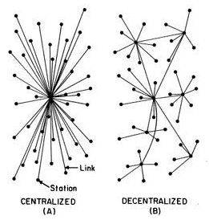
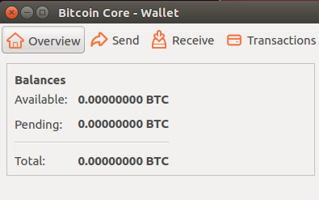

# The world’s blockchain data

Our world has numerous production blockchain networks which are transacting real-value in real-time. Examples of these exciting projects include [Bitcoin](https://bitcoin.org/en/), [Ethereum](https://ethereum.org/) and [CyberMiles](https://www.cybermiles.io/en-us/).

CyberMiles is a public e-commerce blockchain which supports a global community of buyers and sellers. The CyberMiles mainnet was launched in October 2018 and since then the global CyberMiles community have been invited to create and deploy their own smart contracts and decentralized blockchain applications (DApps) on the CyberMiles blockchain.

As we will discover shortly, smart contracts and DApps generate a lot of immutable blockchain data. Unsurprisingly, the volume of this data is set to increase, as Information Technology (IT) infrastructure moves away from a traditional centralized model, and towards new and emerging decentralised blockchain architectures.

A [new wave of blockchain data](https://medium.com/cybermiles/the-next-wave-in-blockchain-data-36e45bab246) is rising and, right now, there are big opportunities for holistic off-chain search and analytics engines such as Elasticsearch to thrive in the blockchain space. Specifically, in the areas of blockchain data-harvesting, data-interpretation, machine-learning and data-visualization.

This is extremely exciting but as we will soon discover, there is a minor challenge to overcome before Elasticsearch can provide all of the aforementioned benefits to existing blockchain smart contracts and DApps.

# Background

## Decentralisation

Blockchain networks do not have a central authority. Instead, they are decentralized.

(Aleixmateuc[CC BY-SA 4.0 (https://creativecommons.org/licenses/by-sa/4.0)],from Wikimedia Commons)

All individual nodes in a decentralized blockchain network are equal. Every individual node in a blockchain runs the exact same software, and in addition, stores the exact same data.

## Data

As an individual blockchain grows, each node is expected to store the entire history of the blockchain. To put this into perspective, a new Bitcoin Core node needs to perform a one-time download of about 210GB (known as syncing) and from that point onwards, must sustain a further storage overhead of approximately 5-10GB per month [1].

## Mobile first

The aforementioned data requirement of a full node obviously make it impractical for smaller devices like mobile phones and handheld devices to participate as equal nodes in a given blockchain network. 

Smartphones and tablets overtook traditional desktop Personal Computers (PCs), in terms of web traffic, for the first time in mid 2016 [2]. Given the affinity between unstructured p2p networks and decentralized blockchain architectures, it seems obvious that the current and ongoing domination of smaller personal devices in the e-commerce space is inevitable.

So how can these smaller devices interact with the blockchain? Interestingly the only real prerequisite to “spending” on a blockchain network is possessing a key that can sign a transaction [3]. Nowadays, end-users can access a variety of lightweight wallet solutions, which not only store and protect end-users private keys but make it possible for these users to broadcast transaction to the blockchain network. Whilst, these [hardware wallets](https://trezor.io/), [browser extensions](https://chrome.google.com/webstore/detail/metamask-for-cmt/hmiddckbbijmdkamphkgkelnjjdkicck) and [desktop applications](https://get-scatter.com/) provide a mechanism to manage externally owned accounts (EOAs) and broadcast transactions to the blockchain, they essentially only allow end-users to transact value. 

## Scanning the blockchain

It seems obvious that an end user would need to know, at the very least, how much they can spend in a given transaction. This introduces the notion of additional software applications that can provide insights into underlying blockchain data. One excellent example of such software is the original Bitcoin Core Wallet.

